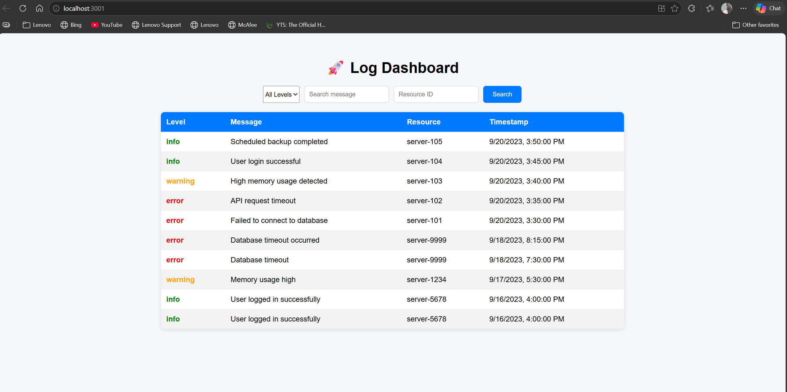
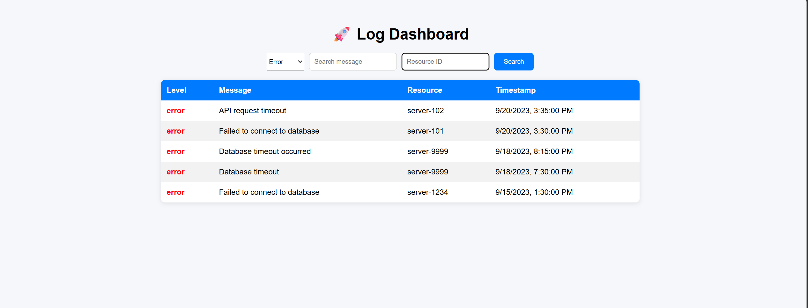
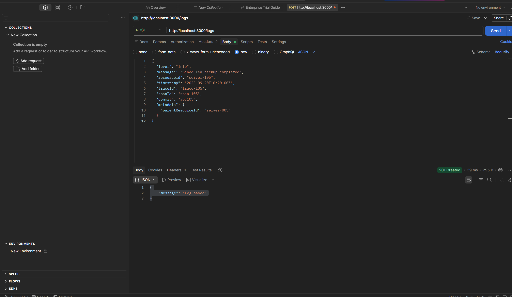

# 🚀 Log Ingestor & Query System

## 🛠 Tech Stack

- Node.js
- Express.js
- MongoDB Atlas
- React.js
- Socket.IO (Real-time updates)

---

## ✨ Features

### 🔹 Log Ingestion

- High-speed log ingestion via HTTP (port 3000)
- Accepts structured JSON logs

### 🔹 Query System

- Full-text search on message
- Filters:
  - level
  - resourceId
  - traceId
  - spanId
  - commit
  - metadata.parentResourceId

- Date range filtering (bonus)

### 🔹 Performance

- Indexed fields for faster queries
- Pagination support
- Sorting by latest logs

### 🔹 Real-Time Updates 🔥

- Implemented using Socket.IO
- New logs appear instantly on UI without refresh

---

## 📡 API Endpoints

### ➤ POST /logs

Ingest logs

#### Example:

```json
{
  "level": "error",
  "message": "Database connection failed",
  "resourceId": "server-123",
  "timestamp": "2023-09-20T10:00:00Z"
}
```

---

### ➤ GET /logs

Query logs with filters

#### Examples:

- Get all logs:

```bash
GET /logs
```

- Filter logs:

```bash
GET /logs?level=error
```

- Full-text search:

```bash
GET /logs?message=database
```

- Combined filters:

```bash
GET /logs?level=error&resourceId=server-123
```

- Pagination:

```bash
GET /logs?page=1&limit=10
```

---

## 🖥 Frontend

- React-based dashboard
- Filter logs easily
- Displays logs in table format
- Real-time updates using WebSockets

---

## ⚙️ How to Run

### Backend

```bash
npm install
node server.js
```

Runs on:
http://localhost:3000

---

### Frontend

```bash
cd client
npm install
npm start
```

Runs on:
http://localhost:3001

---

## 🧠 Design Decisions

- MongoDB used for flexible schema and scalability
- Indexing used for faster query performance
- REST API for ingestion and querying
- Socket.IO used for real-time updates

---

## 🔮 Future Improvements

- Integrate Elasticsearch for advanced search
- Use Kafka for high-throughput ingestion
- Add authentication and role-based access
- Deploy using Docker and cloud services

---

## 📸 Screenshots

### Dashboard View



### Filtered Logs



### API Testing (Postman)



## 👨‍💻 Author

John Bantu
